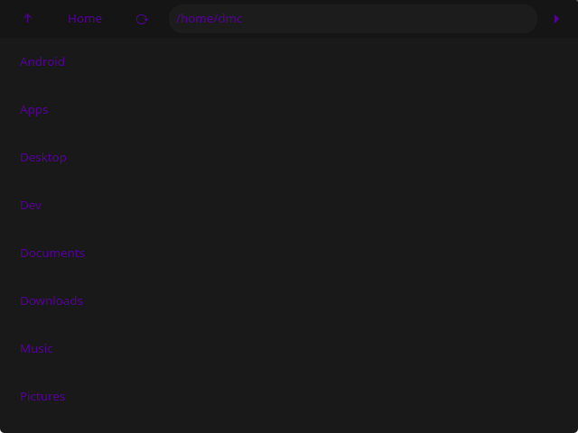

# NManager

NManager is a simple file manager, written in C and using GTK4, that allows you to:
* View all files/folders in a directory
* Add files/folders
* Permanently delete files/folders
* Move file/folders to trash

**NOTE: NManager has only been tested and built on Linux and Windows (using MSYS2).**

## Building from Source

### Prequisites

* [Git](https://git-scm.com/downloads)
* [CMake](https://cmake.org/download/) (3.16 or later)
* [GTK4](https://www.gtk.org/docs/installations/) (for Linux, install the development package)
* C compiler (e.g. GCC or Clang)
* A build system (e.g. Make or Ninja)

#### Windows

* Download and install [MSYS2](https://www.msys2.org/)
* In the MSYS2 UCRT64 terminal, run: `pacman -S git mingw-w64-ucrt-x86_64-cmake mingw-w64-ucrt-x86_64-gtk4 mingw-w64-ucrt-x86_64-toolchain base-devel` to install all the dependencies needed for NManager

**NOTE: The home folder in NManager will be `C:\msys64\home\<user>` instead of `C:\Users\<user>`**

### Building

In a terminal, type the following commands:
1. Clone this repo with `git clone https://github.com/DamareonC/NManager.git`
2. Move into the directory with `cd NManager`
3. Generate the build files with `cmake -B build`
4. Build Starship with `cmake --build build`*

*You can also use the `--parallel <cores>` option to specify how many cores you want to use to build Starship. Just replace `<cores>` with the desired number of cores.

After building, the executable will be under the build/bin folder.